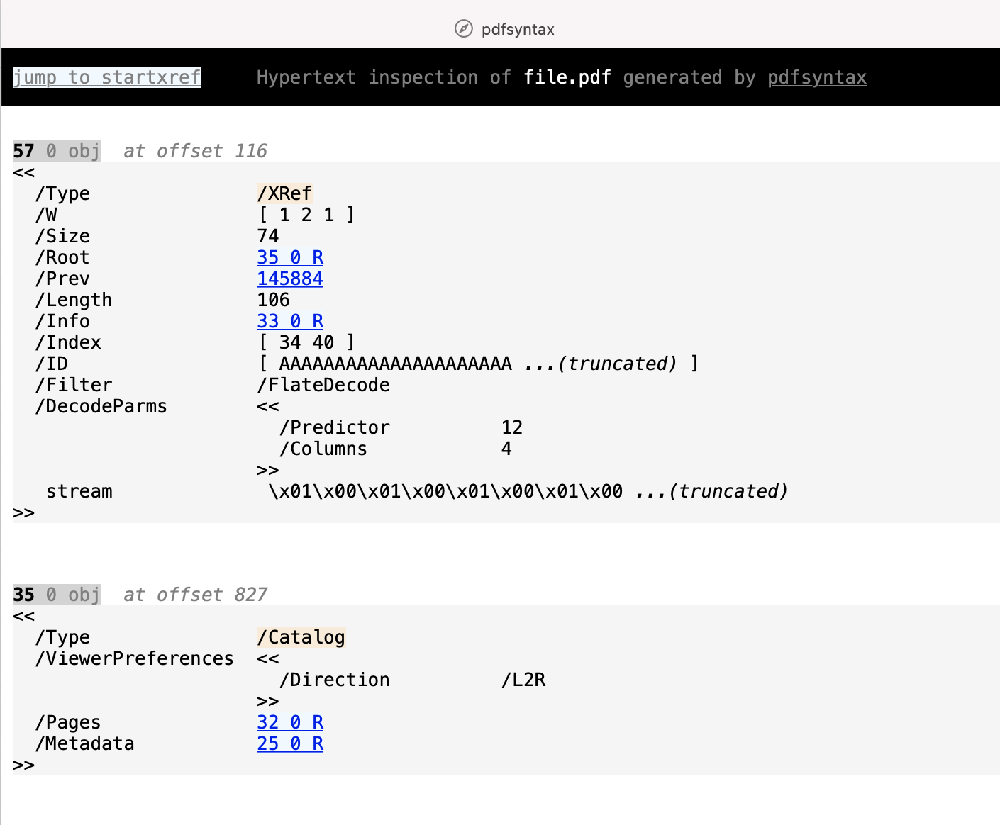

PDFSyntax
=========

*A Python tool to generate a static HTML file that represents the internal structure of a PDF file*

At some point the low-level functions developed for this CLI will be exposed as an API for programmatic use.

WORK IN PROGRESS!

## CLI

### Features
The generated HTML looks like the raw PDF file with the following additions:
* Pretty-print dictionary object
* Extract an object contained in an object stream and insert it in the flow like a regular object
* Decompress stream and display a small part of it
* Turn indirect object reference into hyperlink
* Turn offset reference (for example a /Prev entry) into hyperlink
* Put some color on key names (for example /Type)
* Display offset of an object

### Screenshot

### Usage
Generate the HTML file and open it in your browser:

    python3 -m pdfsyntax inspect file.pdf > inspection.html

## API
(TODO)

